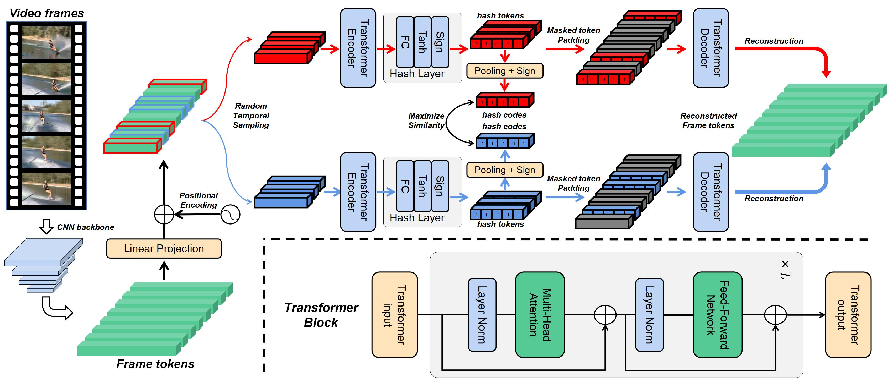

# Contrastive Masked Autoencoders for Self-Supervised Video Hashing

This repository is the official PyTorch implementation of our AAAI 2023 paper [Contrastive Masked Autoencoders for Self-Supervised Video Hashing](https://arxiv.org/abs/2211.11210).




## Catalogue <br> 
* [1. Getting Started](#getting-started)
* [2. Train](#train)
* [3. Test](#test)
* [4. Trained Models](#trained-models)
* [5. Results](#results)
* [6. Citation](#citation)


## Getting Started

1\. Clone this repository:
```
git clone https://github.com/haungmozhi9527/ConMH.git
cd ConMH
```

2\. Create a conda environment and install the dependencies:
```
conda create -n conmh python=3.6
conda activate conmh
conda install pytorch==1.6.0 cudatoolkit=10.1 -c pytorch -c conda-forge
pip install -r requirements.txt
```

3\. Download Datasets: VGG features of FCVID and YFCC are kindly uploaded by the authors of [SSVH]. ResNet50 features of ActivityNet are kindly provided by the authors of [BTH]. You can download them from Baiduyun disk. 

| *Dataset* | *Link* |
| ---- | ---- |
| FCVID | [Baidu disk](https://pan.baidu.com/s/1v0qo4PtiZgFB9iLmj3sJIg?pwd=0000) |
| ActivityNet | [Baidu disk](https://pan.baidu.com/s/1cDJ0-6T2-AOeLgp5rBihfA?pwd=0000) |
| YFCC | [Baidu disk](https://pan.baidu.com/s/1jpqcRRFdiemGvlPpukxJ6Q?pwd=0000) |

4\. Set data_root and home_root in config files (*e.g.*, ./configs/conmh_fcv.py).

## Train

To train ConMH on FCVID:
```
python train.py --gpu 0 --config configs/conmh_fcv.py
```

To train ConMH on ActivityNet:
```
python train.py --gpu 0 --config configs/conmh_act.py
```

To train ConMH on YFCC:
```
python train.py --gpu 0 --config configs/conmh_yfcc.py
```

## Test

To test ConMH on FCVID:
```
python eval.py --gpu 0 --config configs/conmh_fcv.py
```

To test ConMH on ActivityNet:
```
python eval.py --gpu 0 --config configs/conmh_act.py
```

To test ConMH on YFCC:
```
python eval.py --gpu 0 --config configs/conmh_yfcc.py
```

## Trained Models

We provide trained ConMH checkpoints. You can download them from Baiduyun disk.

| *Dataset* | *16 bits* | *32 bits* | *64 bits* |
| ---- | ---- | ---- | ---- |
| FCVID | [Baidu disk](https://pan.baidu.com/s/1sHoQ1iZCL0DmxxLCOH-BnQ?pwd=0000) | [Baidu disk](https://pan.baidu.com/s/1rF2Pbudz7PEJNbF6pcAqag?pwd=0000) | [Baidu disk](https://pan.baidu.com/s/1EbH9pZGGahDjCiv_d20C3g?pwd=0000) |
| ActivityNet | [Baidu disk](https://pan.baidu.com/s/1nxjOd2OvT3Q08P7UPo5XIQ?pwd=0000) | [Baidu disk](https://pan.baidu.com/s/1uVDjJDl0VeWwxHlS6rY7PA?pwd=0000) | [Baidu disk](https://pan.baidu.com/s/1gBpY5iOVciJZe-J8zgrtNg?pwd=0000) |
| YFCC | [Baidu disk](https://pan.baidu.com/s/1RH6e0-AClX0KK9Nzdvx5OA?pwd=0000) | [Baidu disk](https://pan.baidu.com/s/1WVeSI8jUb7L3inqGDwmvMw?pwd=0000) | [Baidu disk](https://pan.baidu.com/s/1UBSE_CDwesa8L5u3OS5S0Q?pwd=0000) |

## Results

### Quantitative Results

For this repository, the expected performance is:

| *Dataset* | *Bits* | *mAP@5* | *mAP@20* | *mAP@40* | *mAP@60* | *mAP@80* | *mAP@100* |
| ---- | ---- | ---- | ---- | ---- | ---- | ---- | ---- |
| FCVID | 16 | 0.350 | 0.252 | 0.216 | 0.196 | 0.181 | 0.169 |
| FCVID | 32 | 0.476 | 0.332 | 0.287 | 0.263 | 0.245 | 0.230 |
| FCVID | 64 | 0.524 | 0.373 | 0.326 | 0.301 | 0.283 | 0.267 |
| ActivityNet | 16 | 0.156 | 0.081 | 0.050 | 0.036 | 0.029 | 0.024 |
| ActivityNet | 32 | 0.229 | 0.124 | 0.075 | 0.054 | 0.042 | 0.035 |
| ActivityNet | 64 | 0.267 | 0.150 | 0.092 | 0.066 | 0.051 | 0.042 |
| YFCC | 16 | 0.225 | 0.146 | 0.122 | 0.113 | 0.108 | 0.104 |
| YFCC | 32 | 0.341 | 0.182 | 0.148 | 0.135 | 0.128 | 0.123 |
| YFCC | 64 | 0.368 | 0.194 | 0.158 | 0.143 | 0.135 | 0.130 |

## Citation

If you find this repository useful, please consider citing our work:

```
@inproceedings{wang23conmh,
  author={Wang, Yuting and Wang, Jinpeng and Chen, Bin and Zeng, Ziyun and Xia, Shu-Tao},
  title={Contrastive Masked Autoencoders for Self-Supervised Video Hashing},
  booktitle={Proceedings of the AAAI Conference on Artificial Intelligence},
  year={2023}
}
```

[SSVH]:https://github.com/lixiangpengcs/Self-Supervised-Video-Hashing

[BTH]:https://github.com/Lily1994/BTH


